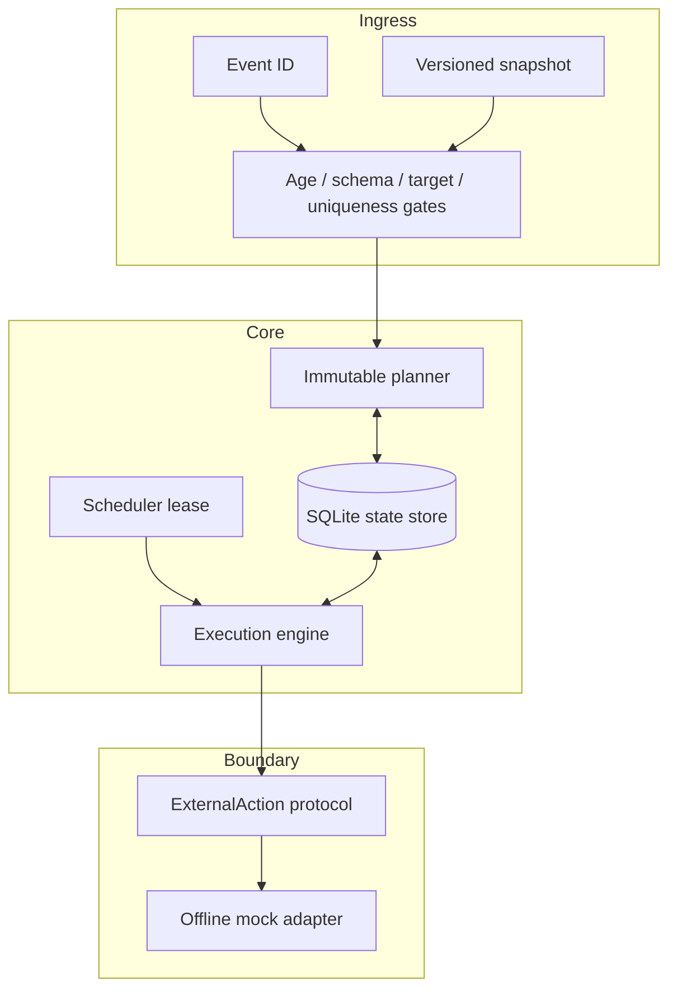
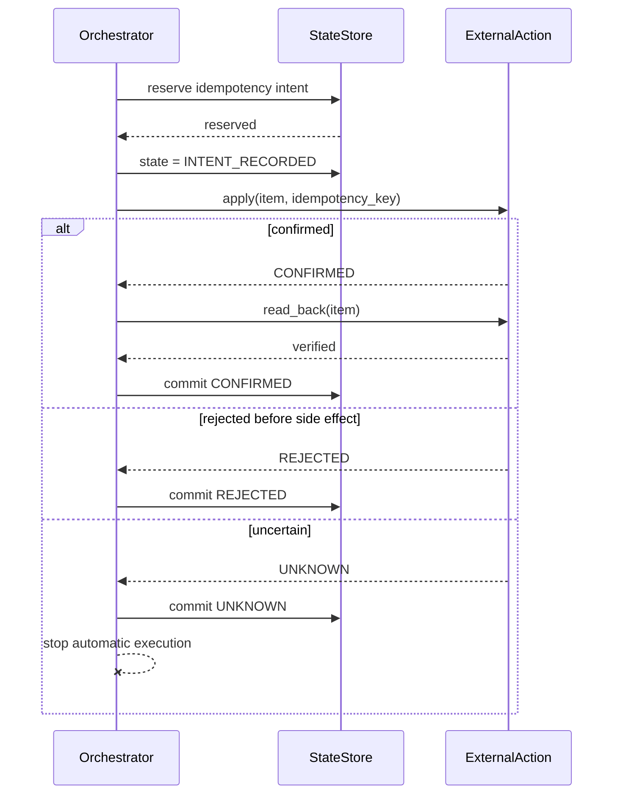

# Architecture

## Components

```mermaid
flowchart TB
    subgraph Ingress
      Event[Event ID]
      Snapshot[Versioned snapshot]
      Gates[Age / schema / target / uniqueness gates]
    end
    subgraph Core
      Planner[Immutable planner]
      Store[(SQLite state store)]
      Engine[Execution engine]
      Lease[Scheduler lease]
    end
    subgraph Boundary
      Port[ExternalAction protocol]
      Mock[Offline mock adapter]
    end
    Event --> Gates
    Snapshot --> Gates
    Gates --> Planner
    Planner <--> Store
    Lease --> Engine
    Store <--> Engine
    Engine --> Port --> Mock
```

## Object sequence

```mermaid
sequenceDiagram
    participant O as Orchestrator
    participant DB as StateStore
    participant A as ExternalAction
    O->>DB: reserve idempotency intent
    DB-->>O: reserved
    O->>DB: state = INTENT_RECORDED
    O->>A: apply(item, idempotency_key)
    alt confirmed
      A-->>O: CONFIRMED
      O->>A: read_back(item)
      A-->>O: verified
      O->>DB: commit CONFIRMED
    else rejected before side effect
      A-->>O: REJECTED
      O->>DB: commit REJECTED
    else uncertain
      A-->>O: UNKNOWN
      O->>DB: commit UNKNOWN
      O--xO: stop automatic execution
    end
```

The database is the source of truth. In-memory iteration is never used to infer whether a batch completed.
